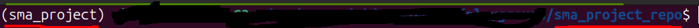
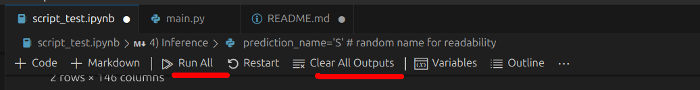

# sma_project_repo
```
The repo which contains all the artifacts used for capstone project for the course "Stock Market Analytics Zoomcamp 2024"
```
# Problem Statement

We want to create a portofolio of 10 stocks from the NIFTY 50 index list of stocks to maximize the profit. The aim is to get a return of atleast 14 % in Indian markets by investing in few stocks which would give a high growth to the invested corpus.

This is a mere analysis of shorts and can be extended to any period of time. 
The period choosen for the analysis is from 1st April, 2009( just after the financial crisis ) to 31st March,2024. 

It is assumed as if we have the data from 1st April, 2009 onwards upto <u>31st March,2023</u>. And since 1st april, 2023, we are investing $12000 in total in both SBI NIFTY 50 ETF (SYMBOL-> NSE:SETFNIF50 ) and the portfolio of stocks we would decide for next 12 months.
* So we would be investing $1000 in both ETF, every month , from 1st April,2023 to 31st March, 2024. 
* For the pre-analysed portfolio, we are taking all the money (12000) and investing in the predictions made by the model. 
At the end of the 1 year, that is 1st April,2024, we would compare the growth in investment between ETF and pre-analysed-portfolio: whether it beats the ETF or not or remains same.

The charges considered are as per the Zerodha's Equity delivery charges:

1. [a]Brokerage= 0
2. [b]STT/CTT = 0.1 %  on buy and sell
3. [c]Transaction CHarges( NSE )  = 0.00322%
4. [d]SEBI Charges = Rs.10 upto 1 crore
5. GST = 18% ( [a] + [b] + [d])


NOTE: 
1. We are only buy and hold would only sell after the 1 year, as to avoid the short term capital gain tax.
2. As we are going long on the stocks and ETF, holding it for almost 1 year, the trading simulation done would be very different than the way it was dicussed on the course. 

# folder and it's significance 

`scripts/data_repo.py` ---> get the data from the respective resources

`scripts/transform.py` ---> transforming the data to be suitable enough to be used for the modelling

`scripts/train.py` ---> training the data based on the best parameters


`script_test.ipynb` ---> Testing each script before using it in the main python file.


`main.py` ---> to be used for direct execution for cron jobs


# Running the repo locally

## Setting up the environment (in Terminal using `conda`)

1. First clone the project from the branch 
1. Change the directory to the  `sma_project_repo`  with the command `cd sma_project_repo`.
1. You can use conda or venv to create the virtual environment. Here we are using the virtual environment.
    1. Create a clone of your base conda environment using command `conda create --name sma_project --clone base`
    1. Activate the environment with `conda activate sma_project`.
    1. Using pip install the necessary requirments into the new environment with command `python -m pip install -r requirements.txt`

## Running the project

Pre - requisite:
you are inside the directory `sma_project_repo` and have activated the env  `sma_project` and the terminal should look somewhat like below.


1. To run the `script_test.ipynb`, we can run it inside VS code or in jupyter lab: 
    1. Running the Script inside VS Code:
        1. Start the VS code from the curren folder using the command `code .`
        1. open the file `script_test.ipynb`, click on the `Clear All Outputs` to  clear all the output from the previosu run, so that you would get a  clean notebook with only the code and markdown.
        1. CHeck whether the kernel with the name `sma_project` is activated or not. 
        1. Then click on the `Run All` to run all the cells.
        
    1. Running the script with Jupyter Lab:
        1. Similar to code, start the Jupyter lab server in the `sma_project_repo` folder by executing the command `jupyter-lab`.
        1. In the server opened in your deafult browser, Check if you are in the correct folder.
        1. Then check if the correct kernel is shown in the right top corner.
        1. then Run all the  cells by using by going `Run >>> Run All Cells`.
        
P.S. For both the cases, if all the cells run without error you will get the output for the Inference at the end. If not, it would be great if you make a issue on the repo and I will check it out.


## Future Improvements or Thing yet to be done:

1. Not implemented the trading Simulation as per problem statement which would be very different from what has been done in the course. This is an analysis and so we have to create a new type of simulation strategy to comapre the investments growth when the money is invested in ETF (monthly) and on all the pre-analysed portfolio.
